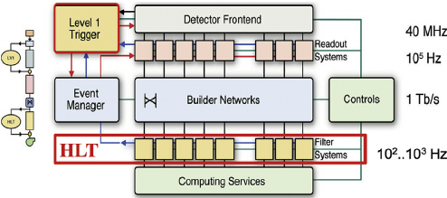

## The CMS acquisition and trigger systems

Collisions at the LHC happen at a **rate** close to 40 million per second (40 MHz).  Once each collision is *sensed* by the different subdetectors, the amount of information they generate for each one of them corresponds to about what you can fit in a 1 MB file.  If we were to record every single collision, it is said (you can do the math) that one can probably fill out all the available disk space in the world in a few days!  

Fortunately, as you know, not all collisions that happen at the LHC are interesting, so we do not have to record every single one of them.  We want to keep the interesting ones and, most importantly, do not miss the **discovery-quality** ones.  In order to achieve that we need a *Trigger*.

Before we jump into the details for the trigger system, let's agree on some terminology:

- **Fill**: Every time the LHC injects beams in the machine it marks the beginning of what is known as a *Fill*.  When they dump the beams, it marks the end of that Fill.  Each Fill is given a unique number.  Some of these fills are declared *stable* and *good for physics* and that is when we, the detectors, collect the data good for doing quality research.

- **Run**: As collisions happen in the LHC, CMS (and the other detectors) decide whether they start *recording* data.  Every time the *start* button is pushed, a new *Run* starts and it is given a unique number.  The Run can stop for a variety of reasons, like if the LHC dumps the fill, but usually it is because there is some glitch in one the thousands of electronics channels in the detector that causes the acquisition to stop.  This is why the *recorded* (by the detectors) and *delivered* data (by the LHC) is not usually the same.  When the acquisition is restarted, a new run number is assigned.

- **Lumi section**: while colliding, the LHC's delivered instantaneous luminosity gets degraded (in general, it decreases) due to different reasons.  I.e., it is not constant over time.  For practical reasons, CMS groups the events it collects in *luminosity sections*, where the luminosity values can be considered constant.

In the plot you can see the different beam (B) injections.  For this particular case, around 2 am that day, collisions were declared stable and lasted until around 15H.  The luminosity (which is dependent on the intensity of the proton bunches)starts decreasing as time goes by for this example fill.

## The trigger system

Deciding on which events to record is the main purpose of the trigger system.  It is like deciding which events to record by taking a **quick picture** of it and, even though a bit blurry, decide whether it is interesting to keep or not for a future, more thorough inspection.  

CMS does this in two main steps.   The first one, the **Level 1 trigger** (L1), implemented in hardware (fast FPGAs), reduces the input rate of 40 Mhz to around 100 KHz.  The other step is the **High Level Trigger** (HLT), run on commercial machines with good-old C++ and Python, where the input rate is leveled around the maximum available budget of around 1-2 KHz.

There are hundreds of different triggers in CMS.  Each one of them is designed to pick certain types of events, with different intensities and topologies.  For instance the `HLT_Mu15` trigger, will select events with at least one muon with *15 GeV* of transverse momentum.  But how can one know this?  We will try to answer that later.

For now, let's just mention that these triggers are **implemented using CMSSW code** (remember, the CMS experiment uses CMSSW to acquire, produce, process and even analyze its data), using pieces of it (modules) that can be arranged to achieve the desired result: selecting specific kinds of events.  Therefore, computationally, triggers are just *Paths* in the CMSSW sense, and one could extract a lot of information by exploring the Python configuration of these paths.

Rember, in the CMSSW pre-exercise we saw that, at the end of the configuration file, we could have something like

~~~
process.mypath = cms.Path (process.m1+process.m2+process.s1+process.m3)
~~~
{: .language-python}

, where `m1`, `m2`, `m3` could be CMSSW modules (individual EDAnalyzers, EDFilters, EDProducers, etc.) and `s1` could be a [Sequence of modules](https://twiki.cern.ch/twiki/bin/view/CMSPublic/SWGuideAboutPythonConfigFile#Module_sequences).

An example of such an arrangement for an HLT trigger looks like:

~~~
process.HLT_Mu15_v2 = cms.Path( process.HLTBeginSequenceBPTX + process.hltL1sL1SingleMu10 + process.hltPreMu15 + process.hltL1SingleMu10L1Filtered0 + process.hltL2Mu10L2Filtered10 + process.HLTL2muonrecoSequence + process.hltL3Muon15 + process.HLTL3muonrecoSequence + process.HLTEndSequence )
~~~
{: .language-python}

Finally, triggers are code, and those pieces of code are constantly changing.  Modifications to a trigger could imply a different version identifier.  For instance, our `HLT_Mu15` could actually be `HLT_Mu15_v2` or `HLT_Mu15_v3`, etc., depending on the version.  Therefore, it is completely normal that the trigger names can **change from run to run**.

## Prescales

The need for prescales (and its meaning) is evident if one thinks of different physics processes having different cross sections.  Roughly speaking, we are a lot more likely to record one minimum bias event, than an event where a Z boson is produced.  Even less likely is to record an event with a Higgs boson.  We could have triggers named, say, `HLT_ZBosonRecorder` for the one in charge of filtering Z-carrying events, or `HLT_HiggsBosonRecorder` for the one accepting Higgses (the actual names are more sophisticated and complex than that, of course.)   The prescales are designed to keep these inputs under control by, for instance, recording just 1 out of 100 collisions that produce a likely Z boson, or 1 out of 1 collisions that produce a potential Higgs boson.  In the former case, the prescale would be 100, while for the latter it would be 1; if a trigger has a prescale of 1, i.e., records every single event it identifies, we call it **unprescaled**.

Maybe not so evident is the need for trigger prescale changes for keeping up with luminosity changes.  As the luminosity drops, prescales can be relaxed, and therefore **can change from to run** in the same fill.

A trigger can be prescaled at L1 as well as the HLT levels.  L1 triggers have their own nomenclature and can be used as HLT trigger *seeds*.

## Triggers, streams and datasets

After events are accepted by possibly more than one type of trigger, they are streamed in different categories, called **streams** and then classified and arranged in primary **datasets**.  Most, but not all, of the datasets belonging to the stream A, the physics stream, are or will become available as CMS Open Data. There are many more datasets and streams than depicted in the figure below.  Datasets in read are examples of those we do not plan to release as open data, while the one in green is an example of those that we do.

Finally, it is worth mentioning that:

- an event can be triggered by many trigger paths
- trigger paths are unique to each dataset
- **the same event can arrive in two different datasets** (this is speciall important if working with many datasets as event duplication can happen)


