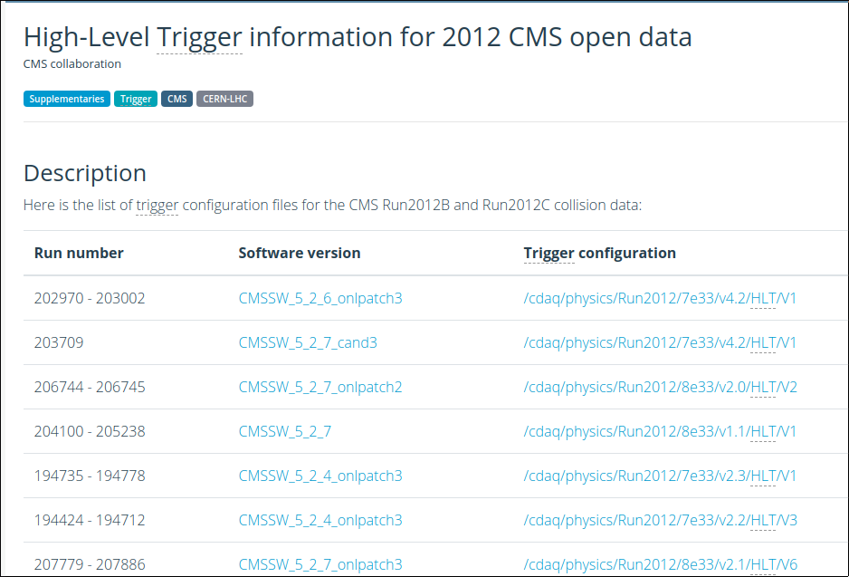

> ## Choosing the dataset
> During the workshop you will learn more about datasets.  For this exercise, however, imagine that we are interested in searching for [Higgs to taus](http://cms-results.web.cern.ch/cms-results/public-results/publications/HIG-13-004/index.html).  Since we will have these heavy charged leptons in the final step, we will choose the [2012 TauPlusX](http://opendata.cern.ch/record/6024) datasets. An example of this simplified analysis is already available at the [CERN Open Portal](http://opendata.web.cern.ch/record/12350).
{: .callout}

## Exploring the triggers in your dataset

After choosing the appropriate dataset for you analysis, the first thing you need to decide is which trigger to use.  

If you click on the [2012 TauPlusX](http://opendata.cern.ch/record/6024) dataset record, you will find a list triggers that were streamed to that dataset.  Now, the question is, which one would you use for this analysis?  Here's where the physics starts playing a role.  Let's imagine we concentrate only on tau lepton pairs of which one tau lepton decays into a muon and two neutrinos and the other tau lepton hadronically, then we shall pick our trigger(s) accordingly.  Note that the published CMS analysis considers additional decay channels.

Let's try to click on one of those triggers, for instance [HLT_IsoMu8_eta2p1_LooseIsoPFTau20](http://opendata.cern.ch/record/6549); there, you can find additional information about this trigger.  One thing to notice, if you check the [2012 run range](http://opendata.cern.ch/record/1002), is that this trigger was only available towards the end of the data taking period. As a matter of fact, since we have only released half of the 2012 data, you will not find that trigger yet in the current releases.

So we have learned that triggers could be not persistent and be only available for certain runs.  Besides, as it was mentioned, the trigger code evolves.  There may be different versions of this trigger, for instance, `HLT_IsoMu8_eta2p1_LooseIsoPFTau20_v1`, or `v2`, `v3`, etc.

In order to check the trigger information we need to use the trigger tools provided in CMSSW.  This [record](http://opendata.cern.ch/record/5004) points you to some examples of the usage of such code.  Let's use, for instance, some of the snippets presented in the [source file](https://github.com/cms-opendata-analyses/TriggerInfoTool/blob/2011/GeneralInfoAnalyzer/src/TriggerInfoAnalyzer.cc) of the [GeneralInfoAnalyzer](https://github.com/cms-opendata-analyses/TriggerInfoTool/tree/2011/GeneralInfoAnalyzer) package to dump all the triggers in our dataset.

First, make sure you go to your `CMSSW_5_3_32/src` area and issue a `cmsenv` command, as you will always do.

To simplify the exercise, we will use the same source file we used for validation, the `Demo/DemoAnalyzer/src/DemoAnalyzer.cc`.  Let's modify it so we can use it to dump all the triggers in our dataset.  In the process, **let's comment out some of what we did for extracting the muon energy** so it does not clutter our output.

Insert the header for the `HLTConfigProvider` class:

~~~
//classes to extract Muon information
#include "DataFormats/MuonReco/interface/Muon.h"
#include "DataFormats/MuonReco/interface/MuonFwd.h"

//for trigger configuration
#include "HLTrigger/HLTcore/interface/HLTConfigProvider.h"

//the standard c++ vector class
#include<vector>
~~~
{: .language-cpp}

Next, insert the declaration of the variables we will need in our configuration file (process name, dataset name) and an object of class `HLTConfigProvider`, which we can use to extract the information about what the trigger configuration was for some run:

~~~
  virtual void beginLuminosityBlock(edm::LuminosityBlock const&, edm::EventSetup const&);
  virtual void endLuminosityBlock(edm::LuminosityBlock const&, edm::EventSetup const&);

  //declare the input tag for MuonCollection
  //edm::InputTag muonInput;

  // ----------member data ---------------------------
  //std::vector<float> muon_e;

  //for trigger config
  std::string   processName_;
  std::string   datasetName_;
  //HLT config provider object
  HLTConfigProvider hltConfig_;
~~~
{: .language-cpp}

Add the lines to read the configuration in the constructor and print it out (note the way it is done differs a bit from what we did earlier for the muons.  They are, of course, equivalent):

~~~
// constructors and destructor
//
DemoAnalyzer::DemoAnalyzer(const edm::ParameterSet& iConfig):
processName_(iConfig.getParameter<std::string>("processName")),
datasetName_(iConfig.getParameter<std::string>("datasetName"))
{
   //now do what ever initialization is needed
   //muonInput = iConfig.getParameter<edm::InputTag>("InputCollection")
  using namespace std;
  using namespace edm;

  //Print the configuration just to check
  cout << "Here is the information passed to the constructor:" <<endl;
  cout << "Configuration: " << endl
       << "   ProcessName = " << processName_ << endl
       << "   DataSetName = " << datasetName_ << endl;

}
~~~
{: .language-cpp}

Don't forget to comment out all the muon stuff in the analyze method so it does not bother us:
~~~
void
DemoAnalyzer::analyze(const edm::Event& iEvent, const edm::EventSetup& iSetup)
{
 using namespace edm;
 //clean the container
 //muon_e.clear();

 //define the handler and get by label
 //Handle<reco::MuonCollection> mymuons;
 //iEvent.getByLabel(muonInput, mymuons);

 //if collection is valid, loop over muons in event
 //if(mymuons.isValid()){
//    for (reco::MuonCollection::const_iterator itmuon=mymuons->begin(); itmuon!=mymuons->end(); ++itmuon){
//        muon_e.push_back(itmuon->energy());
//    }
 //}

 //print the vector
//  for(unsigned int i=0; i < muon_e.size(); i++){
//    std::cout <<"Muon # "<<i<<" with E = "<<muon_e.at(i)<<" GeV."<<std::endl;
 //}

#ifdef THIS_IS_AN_EVENT_EXAMPLE
   Handle<ExampleData> pIn;
   iEvent.getByLabel("example",pIn);
#endif

#ifdef THIS_IS_AN_EVENTSETUP_EXAMPLE
   ESHandle<SetupData> pSetup;
   iSetup.get<SetupRecord>().get(pSetup);
#endif
}

~~~
{: .language-cpp}

And, finally, modify the `beginRun` fuction giving a name to `iRun` and `iSetup` arguments and adding the trigger dump.  Remember we have to check the triggers available at each change in runs:
~~~
// ------------ method called when starting to processes a run  ------------
void
DemoAnalyzer::beginRun(edm::Run const& iRun, edm::EventSetup const& iSetup)
{

  using namespace std;
  using namespace edm;

  //If the hltConfig can be initialized, then the below is an example of
  //how to extract the config information for the trigger from the
  //so-called provenance.

  // The trigger configuration can change from
  // run to run (during the run is the same),
  // so it needs to be called here.

  ///   "init" return value indicates whether intitialisation has succeeded
  ///   "changed" parameter indicates whether the config has actually changed

  bool changed(true);
  if (hltConfig_.init(iRun,iSetup,processName_,changed)) {
      if (changed) {
        const vector<string> triggerNamesInDS = hltConfig_.datasetContent(datasetName_);
         for (unsigned i = 0; i < triggerNamesInDS.size(); i++) {
            cout<<triggerNamesInDS[i]<<endl;
          }
	    }
  }

}

~~~
{: .language-cpp}

Before compiling, change your `Demo/DemoAnalyzer/BuildFile.xml` to include the `HLTrigger/HLTcore` package, where the `HLTConfigProvider` resides:

~~~
<use name="FWCore/Framework"/>
<use name="FWCore/PluginManager"/>
<use name="DataFormats/MuonReco"/>
<use name="FWCore/ParameterSet"/>
<use name="HLTrigger/HLTcore"/>
<flags EDM_PLUGIN="1"/>
<export>
   <lib name="1"/>
</export>
~~~
{: .language-xml}

Compile the code the usual way:
~~~
scram b
~~~
{: .language-bash}

Now, let's modify the configuration file `Demo/DemoAnalyzer/demoanalyzer_cfg.py` to adapt it to our exercise.  First, let's go back to logging for each event (and not for every 5) and change the number of events to `-1`, so we can run over all of them. Also, change the `PoolSource` file; replace it with a couple of files from our dataset selection.  In addition, comment out what we had done for extracting the muon information and adding the HLTHighLevel filter, and replace it with parameters we need at configuration.  Do not forget to notice that we are naming our process `mytrigger` now, and not `demo`.  

Also, **make absolutely sure you have access to the conditions database information needed for 2012, which is different than that for 2011**.  Here is where there is a key difference between using the **Virtual Machine** or the **Docker container**.  When using the **Virtual Machine**, you have to replace the three lines that have `GlobalTag` in them with:

~~~
#needed to access the conditions data from the Virtual Machine
process.load('Configuration.StandardSequences.FrontierConditions_GlobalTag_cff')
process.GlobalTag.connect = cms.string('sqlite_file:/cvmfs/cms-opendata-conddb.cern.ch/FT53_V21A_AN6_FULL.db')
process.GlobalTag.globaltag = 'FT53_V21A_AN6::All'
~~~
{: .language-python}

On the other hand, if you are using the Docker container add these lines:

~~~
#needed to access the conditions data from the Docker container
process.load('Configuration.StandardSequences.FrontierConditions_GlobalTag_cff')
process.GlobalTag.connect = cms.string('sqlite_file:/opt/cms-opendata-conddb/FT53_V21A_AN6_FULL_data_stripped.db')
process.GlobalTag.globaltag = 'FT53_V21A_AN6_FULL::All'
~~~
{: .language-python}

These lines, with the `GlobaTag` string in them, have to do with being able to read CMS database information.  We call this the **conditions data** as we may find values for calibration, alignment, trigger prescales, etc., in there .  One can think of the `GlobalTag` as a label that contains a set of database snapshots that need to be adequate for a point in time in the history of the CMS detector.  For the 2012 open data release, the global tag is `FT53_V21A_AN6` or `FT53_V21A_AN6_FULL` (the `::All` string is a flag that tells the frameworks to read *All* the information associated with the tag).  You can find more information in this [CODP guide](http://opendata.cern.ch/docs/cms-guide-for-condition-database).

The `connect` variable in one of those lines just modifies they way in which the framework is going to access these snapshots. For the VM we access them through the shared files system area at CERN (cvmfs).  Read in this way, the conditions will be cached locally in your virtual machine the first time you run and so the CMSSW job will be slow.  Fortunately, we already did this while setting up our VM, so our jobs will run much faster.  In addition, those soft links he had to make are simply pointers to these areas.

On the other hand, in the Docker container, these database snapshots live locally in your `/opt/cms-opendata-conddb` directory.  Running over them is much quicker.

Feel free to just replace the whole config file with the final version below (if using the VM, *uncomment and comment out the section in question appropriately*).

The final config file should look something like:

~~~
import FWCore.ParameterSet.Config as cms

process = cms.Process("Demo")

process.load("FWCore.MessageService.MessageLogger_cfi")
process.MessageLogger.cerr.FwkReport.reportEvery = 1

process.maxEvents = cms.untracked.PSet( input = cms.untracked.int32(-1) )

process.source = cms.Source("PoolSource",
    # replace 'myfile.root' with the source file you want to use
    fileNames = cms.untracked.vstring(
    #    'file:myfile.root'
	  #'root://eospublic.cern.ch//eos/opendata/cms/Run2012B/DoubleMuParked/AOD/22Jan2013-v1/10000/1EC938EF-ABEC-E211-94E0-90E6BA442F24.root'
    'root://eospublic.cern.ch//eos/opendata/cms/Run2012B/TauPlusX/AOD/22Jan2013-v1/20000/0040CF04-8E74-E211-AD0C-00266CFFA344.root',
    'root://eospublic.cern.ch//eos/opendata/cms/Run2012C/TauPlusX/AOD/22Jan2013-v1/310001/0EF85C5C-A787-E211-AFC9-003048C6942A.root'
    )
)

#uncomment to access the conditions data from the Virtual Machine (and comment out the Docker container set below)
#process.load('Configuration.StandardSequences.FrontierConditions_GlobalTag_cff')
#process.GlobalTag.connect = cms.string('sqlite_file:/cvmfs/cms-opendata-conddb.cern.ch/FT53_V21A_AN6_FULL.db')
#process.GlobalTag.globaltag = 'FT53_V21A_AN6::All'

#needed to access the conditions data from the Docker container
process.load('Configuration.StandardSequences.FrontierConditions_GlobalTag_cff')
process.GlobalTag.connect = cms.string('sqlite_file:/opt/cms-opendata-conddb/FT53_V21A_AN6_FULL_data_stripped.db')
process.GlobalTag.globaltag = 'FT53_V21A_AN6_FULL::All'

process.mytrigger = cms.EDAnalyzer('DemoAnalyzer',
	#InputCollection = cms.InputTag("muons")
    processName = cms.string("HLT"),
    datasetName = cms.string("TauPlusX"), #specific dataset example (for dumping info)          
)

#process.load("HLTrigger.HLTfilters.hltHighLevel_cfi")
#process.hltHighLevel.HLTPaths = cms.vstring('HLT_Mu15*')

#process.p = cms.Path(process.hltHighLevel+process.demo)
process.p = cms.Path(process.mytrigger)

~~~
{: .language-python}

Note that the process name is always `HLT` for data that was processed with the online system.

Let's run:

~~~
cmsRun Demo/DemoAnalyzer/demoanalyzer_cfg.py > full_triggerdump.log 2>&1 &
~~~
{: .language-bash}

Now check the output.  Do you notice anything?

> ## What kind of output did you get?
>
> With the selected dataset files we get:
> ~~~
> 28-Sep-2020 20:36:02 CEST  Successfully opened file root://eospublic.cern.ch//eos/opendata/cms/Run2012B/TauPlusX/AOD/22Jan2013-v1/20000/0040CF04-8E74-E211-AD0C-00266CFFA344.root
> Here is the information passed to the constructor:
> Configuration:
>    ProcessName = HLT
>    DataSetName = TauPlusX
> HLT_Ele22_eta2p1_WP90NoIso_LooseIsoPFTau20_v2
> HLT_Ele22_eta2p1_WP90Rho_LooseIsoPFTau20_v2
> HLT_IsoMu15_eta2p1_L1ETM20_v5
> HLT_IsoMu15_eta2p1_LooseIsoPFTau35_Trk20_Prong1_L1ETM20_v6
> HLT_IsoMu17_eta2p1_LooseIsoPFTau20_v2
> HLT_IsoMu18_eta2p1_MediumIsoPFTau25_Trk5_eta2p1_v7
> HLT_Mu15_eta2p1_L1ETM20_v3
> HLT_Mu17_eta2p1_LooseIsoPFTau20_v2
> Begin processing the 1st record. Run 194075, Event 14880766, LumiSection 48 at 28-Sep-2020 20:36:11.193 CEST
>
> ....
>
> 28-Sep-2020 20:36:21 CEST  Successfully opened file root://eospublic.cern.ch//eos/opendata/cms/Run2012C/TauPlusX/AOD/22Jan2013-v1/310001/0EF85C5C-A787-E211-AFC9-003048C6942A.root
> HLT_Ele22_eta2p1_WP90NoIso_LooseIsoPFTau20_v6
> HLT_Ele22_eta2p1_WP90Rho_LooseIsoPFTau20_v6
> HLT_IsoMu15_eta2p1_L1ETM20_v7
> HLT_IsoMu15_eta2p1_LooseIsoPFTau35_Trk20_Prong1_L1ETM20_v9
> HLT_IsoMu17_eta2p1_LooseIsoPFTau20_v6
> HLT_IsoMu18_eta2p1_MediumIsoPFTau25_Trk1_eta2p1_v3
> HLT_Mu15_eta2p1_L1ETM20_v5
> HLT_Mu17_eta2p1_LooseIsoPFTau20_v6
> Begin processing the 16127th record. Run 200041, Event 386077374, LumiSection 310 at 28-Sep-2020 20:36:27.618 CEST
> ~~~
> {: .output}
>
> In our example, we immediately notice that the configuration changes for different epochs in the 2012 data taking period: the trigger versions are different.  This could mean a modification of some parameter in the trigger, which does not affect the main characteristics, but maybe make it more efficient.  In the next section we will explore one of these triggers to get acquainted with the way we can find more information.   
>
{: .solution}

The bottom line is that one would need to inspect the triggers in this way in order to find a trigger or a set of triggers that are available during the whole run range of interest and make sure that they are available when we try to call them.

## Understanding the triggers using a trigger menu config file

There is some information that we could extract from the names of the triggers in that list.  For instance, the `IsoMu` or `Mu` in the names might indicate the presence of a muon, and the `LoosePFTau` string could indicate the requirement of a tau particle. If that is the case, then we could select, for instance the `HLT_IsoMu17_eta2p1_LooseIsoPFTau20_v?` incarnations of this trigger for our analysis (the `?` wildcard takes the place of any digit).  The numbers generally mean a minimum requirement in transverse momentum, `pT`. But how to be sure?

We can inspect further.  If you go to the [portal page of that trigger](http://opendata.cern.ch/record/6508), you will see the different versions and corresponding run ranges.  Towards the bottom of that page you will find a link to the [Trigger information for 2012 CMS open data](http://opendata.cern.ch/record/1701), which will open a table like the one below:

The page presents the HLT CMSSW configuration files (aka **trigger menus**) that were used for different run ranges.  Although very, very long, those configuration files have the same structure as any CMSSW config file.  I.e., we can see how the trigger was configured and check all the parameters that were used in defining its working software.

Let's pretend we are interested in studying the `v3`of this trigger.  That would correspond to the run range `198249 - 199021` in the page with the trigger menus.  If we click on the config file, we will be taken to [this](http://opendata.cern.ch/record/6107) page from where we can download the [config file](http://opendata.cern.ch/record/6107/files/cdaq_physics_Run2012_7e33_v3.1_HLT_V1.py).

Now, open the config file and search for `HLT_IsoMu17_eta2p1_LooseIsoPFTau20_v3`.    You will immediately see that, indeed, this incarnation of the trigger exists in this config file.  

Then, you can search for `HLT_IsoMu17_eta2p1_LooseIsoPFTau20_v3 =`.  This will prompt you to see the line where the trigger path (in the CMSSW sense) is defined:

~~~
process.HLT_IsoMu17_eta2p1_LooseIsoPFTau20_v3 = cms.Path( process.HLTBeginSequence + process.hltL1sMu14erORMu16er + process.hltPreIsoMu17eta2p1LooseIsoPFTau20 + process.hltL1fL1sMu14erORMu16erL1Filtered0 + process.HLTL2muonrecoSequence + process.hltL2fL1sMu14erORMu16erL1f0L2Filtered14Q + process.HLTL3muonrecoSequence + process.hltL3fL1sMu14erORMu16erL1f0L2f14QL3Filtered17Q + process.HLTL3muoncaloisorecoSequenceNoBools + process.HLTL3muonisorecoSequence + process.hltL3crIsoL1sMu14erORMu16erL1f0L2f14QL3f17QL3crIsoRhoFiltered0p15 + process.HLTRecoJetSequencePrePF + process.hltTauJet5 + process.HLTPFJetTriggerSequenceMuTau + process.hltPFJet20 + process.HLTIsoMuLooseIsoPFTauSequence + process.HLTEndSequence )
~~~
{: .output}

It has several modules and sequences that make up its entire implementation.  All those modules and sequences exist in the same config file, so you can search for them to find out more about the trigger. Right away, however, you can see that at least one of the taus is being consider as a jet, just like a hadronic decay would indicate.  If you want to explore some module, for example `hltPFJet20`, you can search for it and find:

~~~
process.hltPFJet20 = cms.EDFilter( "HLT1PFJet",
  saveTags = cms.bool( False ),
  MinPt = cms.double( 20.0 ),
  MinN = cms.int32( 1 ),
  MaxEta = cms.double( 2.5 ),
  MinMass = cms.double( -1.0 ),
  inputTag = cms.InputTag( "hltAntiKT5PFJets" ),
  MinE = cms.double( -1.0 ),
  triggerType = cms.int32( 84 )
)
~~~
{: .output}

This module is an incarnation of a filter named `HLT1PFJet`, which, if you are getting certain intuition about CMSSW, will find out is a filter recast of the [PFJet Producer](https://github.com/cms-sw/cmssw/blob/CMSSW_5_3_X/DataFormats/JetReco/interface/PFJet.h).

> ## Challenge!
>
> By searching for and exploring the second to last Sequence, i.e., `HLTIsoMuLooseIsoPFTauSequence`, can you name the module which is ultimately responsible for setting the `17 GeV` pT cut on the muon leg of these events?
>
> > ## solution
> >
> > After some searching within the config file, and connecting the dots, you will find that the name of that module is `hltL3fL1sMu14erORMu16erL1f0L2f14QL3Filtered17Q`, which is an incarnation of the `HLTMuonL3PreFilter`.  
> > Were you able to spot it?
> {: .solution}
{: .challenge}


